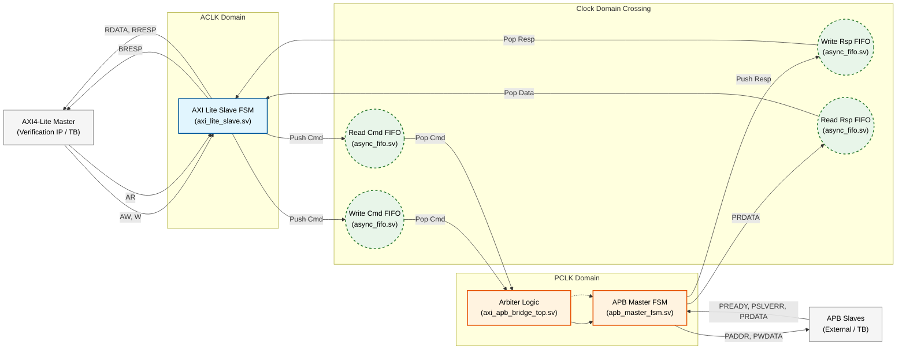

# AXI4-Lite-to-APB-Bridge-with-Asynchronous-CDC
Provide a small, easy-to-verify bridge that accepts AXI4-Lite transactions on the fast side and performs APB transfers to low-speed peripherals on the slow side. The bridge acts as an AXI4-Lite slave and as an APB master to selected peripherals, translating protocol and synchronizing clock domains. 

## Data & Control Flow

