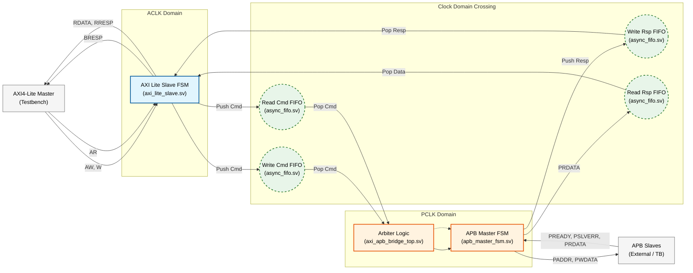
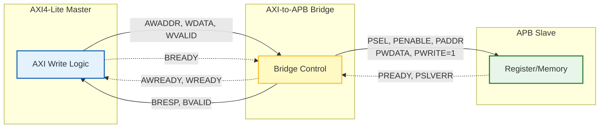
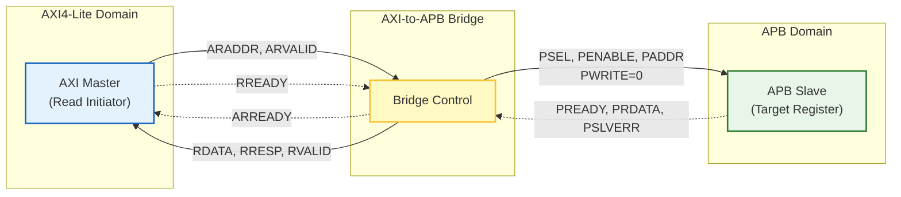
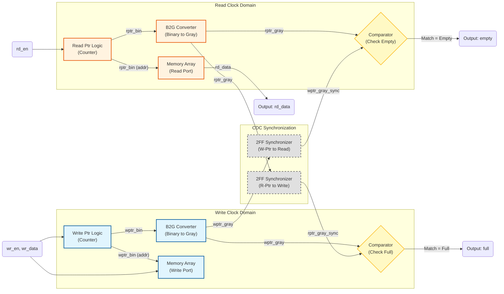

# AXI4-Lite to APB Bridge with Asynchronous CDC

**Author:** Noam Malca  
**Institution:** Bar-Ilan University  
**Focus:** Digital Design - Bus Protocols (AXI/APB), CDC, & Verification

This project implements a synthesizable **AXI4-Lite ↔ APB** bridge in SystemVerilog HDL, connecting a high-speed AXI clock domain to a slower APB clock domain where the bridge operates as an **APB master**.  
The design addresses **CDC** challenges using **asynchronous FIFOs** with Gray-coded pointers and **2-FF synchronizers** on the pointer crossings. Robust flow control is achieved through independent command and response buffering, where the FIFO 'full' status is directly mapped to the AXI `READY` signals to exert backpressure. This mechanism automatically throttles the high-speed master during congestion, ensuring zero data loss.  
The system integrates a modular AXI Slave, a robust APB Master FSM, and a **self-checking SystemVerilog testbench** designed to verify protocol compliance and CDC stability under stress.

---
## Table of Contents

- [Key Features](#key-features)
- [System Overview](#system-overview)
- [Repository Structure](#repository-structure)
- [Modules Description](#modules-description)
    - [AXI-APB Bridge Top-Level](#axi-apb-bridge-top-level)
    - [AXI4-Lite Slave FSM](#axi4-lite-slave-fsm)
    - [APB Master FSM](#apb-master-fsm)
    - [Asynchronous FIFO (CDC)](#asynchronous-fifo-cdc)
    - [Verification Testbench](#verification-testbench-module)
- [Data & Control Flow](#data--control-flow)
- [End-to-End Transaction Logic](#end-to-end-transaction-logic)
- [Asynchronous FIFO Design (CDC)](#asynchronous-fifo-design-cdc)
- [Verification Testbench (Simulation and Waveforms)](#verification-testbench-simulation-and-waveforms)
    - [Test 0 Analysis (Read Request with APB Stall)](#test-0-read-request-with-apb-stall--recovery)
    - [Test 1 Analysis (Write Burst & Backpressure)](#test-1-write-burst-with-backpressure)
    - [Test 2 Analysis (Arbiter Performance & Priority)](#test-2-arbiter-performance-write-priority)
---

## Key Features
* **Protocol Translation:** Converts AXI4-Lite transactions to APB transfers.
* **Robust CDC:** Uses dual-clock asynchronous FIFOs with Gray-code pointer exchange.
* **Metastability Protection:** Implements 2FF synchronizers on all cross-domain control signals.
* **Data Integrity:** Guarantees data consistency between fast (AXI) and slow (APB) clock domains.
* **Arbitration Logic:** Implements a fixed-priority arbiter (Write > Read) to manage simultaneous read and write requests efficiently.
* **Full Verification:** Includes a behavioral APB slave model and automated transaction checkers.

---
## System Overview

The design is structured as a dual-clock system divided into two distinct domains: the **AXI4-Lite Domain (ACLK)** and the **APB Domain (PCLK)**.

The bridge operates by decoupling transaction initiation (AXI) from transaction execution (APB) using a **channel-based FIFO architecture**. This approach allows the AXI Master to post multiple commands into the bridge without waiting for the slow APB peripheral to respond, maximizing system throughput.

### Architectural Highlights

1.  **AXI Front-End (ACLK Domain):**
    * Acts as a compliant AXI4-Lite Slave.
    * Responsible for handshaking with the Master (`READY`/`VALID`) and parsing incoming transactions.
    * Splits requests into two parallel streams: **Write Commands** (Address + Data) and **Read Commands** (Address only).

2.  **Clock Domain Crossing (CDC) Layer:**
    * Four independent **Asynchronous FIFOs** isolate the fast AXI clock from the slow APB clock.
    * **Command Path:** Transfers requests from AXI to APB (`wr_cmd_fifo`, `rd_cmd_fifo`).
    * **Response Path:** Transfers status and data back from APB to AXI (`wr_rsp_fifo`, `rd_rsp_fifo`).
    * This separation prevents Head-of-Line blocking between Read and Write channels inside the bridge.

3.  **Arbiter & APB Back-End (PCLK Domain):**
    * **Arbiter:** Monitors the command FIFOs and serializes requests for the APB Master. It implements a **Fixed-Priority Scheme** where Write transactions are granted precedence over Read transactions to ensure data is committed to memory as fast as possible.
    * **APB Master FSM:** Drives the standard APB protocol (`PSEL`, `PENABLE`, `PADDR`, `PWDATA`) to the external slaves and captures responses.

4.  **Flow Control (Backpressure):**
    * The system implements hardware-based flow control.
    * If a CDC FIFO becomes full (due to APB stalls or high traffic), the "Full" status propagates instantly to the AXI Slave logic.
    * The AXI Slave then de-asserts `AWREADY`, `WREADY`, or `ARREADY`, effectively stalling the AXI Master until buffer space becomes available.
---
## Repository Structure

```text
.
├── SystemVerilog/                  # RTL Source files and Testbench
│   ├── axi_apb_bridge_top.sv       # Top-Level Bridge Module
│   ├── axi_lite_slave.sv           # AXI4-Lite Slave Interface & Logic
│   ├── apb_master_fsm.sv           # APB Master Finite State Machine
│   ├── async_fifo.sv               # Top-level Wrapper for Async FIFO
│   ├── fifo_wptr_full.sv           # FIFO Write Pointer & Full Flag Logic
│   ├── fifo_rptr_empty.sv          # FIFO Read Pointer & Empty Flag Logic
│   ├── sync_2ff.sv                 # 2-Stage Flip-Flop Synchronizer (CDC)
│   └── tb_axi_apb_bridge_top.sv    # Verification Testbench
├── Docs/                           # Documentation assets (Images & Waveforms)
├── LICENSE                         # MIT License
└── README.md                       # Project Documentation
```
---
## Modules Description

### AXI-APB Bridge Top-Level
**File:** [`axi_apb_bridge_top.sv`](SystemVerilog/axi_apb_bridge_top.sv)

The integration layer that creates the complete bridge system. It instantiates the AXI Slave, the APB Master, and the four asynchronous FIFOs.
* **Arbiter Logic:** Implements the **Fixed-Priority Arbitration** logic (Write > Read) to serialize requests for the single APB Master.
* **Flow Control Routing:** Manages the critical `rsp_ready` signals, routing "FIFO Full" status from the response buffers back to the state machines to prevent data loss or deadlock.

---

### AXI4-Lite Slave FSM
**File:** [`axi_lite_slave.sv`](SystemVerilog/axi_lite_slave.sv)

The front-end interface compliant with the AMBA AXI4-Lite protocol. It operates entirely in the fast `ACLK` domain.
* **Handshake Management:** Manages the 5 AXI channels (AW, W, AR, B, R), handling `VALID`/`READY` signals.
* **Command Parsing:** Splits incoming requests into separate "Write" and "Read" streams to be pushed into their respective CDC FIFOs.
* **Backpressure Source:** Directly drives the `AWREADY`, `WREADY`, and `ARREADY` signals low when the internal FIFOs report a "Full" status.

---

### APB Master FSM
**File:** [`apb_master_fsm.sv`](SystemVerilog/apb_master_fsm.sv)

The back-end interface compliant with the AMBA APB protocol (v3/v4). It operates entirely in the slow `PCLK` domain.
* **State Machine:** Implements a robust FSM (States: `IDLE`, `SETUP`, `ACCESS`, `ST_RSP_WAIT`) to drive the address (`PADDR`) and data (`PWDATA`) phases.
* **Stall Handling:** Correctly handles `PREADY` from external slaves, holding the bus in the `ACCESS` phase until the slave is ready.
* **Response Handling:** Captures `PRDATA` and `PSLVERR`, creates a response packet, and pushes it into the Response FIFO to be sent back to the AXI domain.

---

### Asynchronous FIFO (CDC)
**Files:** [`async_fifo.sv`](SystemVerilog/async_fifo.sv), [`fifo_wptr_full.sv`](SystemVerilog/fifo_wptr_full.sv), [`fifo_rptr_empty.sv`](SystemVerilog/fifo_rptr_empty.sv)

A generic, dual-clock First-In-First-Out buffer used for safe Clock Domain Crossing (CDC).
* **Gray Coding:** Converts internal read/write pointers to Gray Code before passing them across clock domains to prevent multi-bit synchronization errors.
* **Storage:** Uses a parameterized memory array (`mem`) with support for FWFT (First-Word-Fall-Through) behavior for low-latency reading.
* **Empty/Full Logic:** Generates reliable status flags to prevent underflow (reading empty) or overflow (writing full).

---

### 2-Stage Synchronizer
**File:** [`sync_2ff.sv`](SystemVerilog/sync_2ff.sv)

A standard hardening block for crossing clock domains.
* **Metastability Protection:** Consists of two flip-flops connected in series. It is used to synchronize the Gray-coded pointers from the source domain into the destination domain, reducing the probability of metastability to negligible levels.

---

### Verification Testbench
**File:** [`tb_axi_apb_bridge_top.sv`](SystemVerilog/tb_axi_apb_bridge_top.sv)

A comprehensive SystemVerilog testbench designed to validate the bridge under stress.
* **Clock Generation:** Generates asynchronous clocks (`ACLK` and `PCLK`) with configurable frequency ratios.
* **Traffic Generation:** Simulates an AXI Master initiating burst transactions and an APB Slave with random stall capabilities (`PREADY` randomization).
* **Automated Checks:** Monitors transaction integrity, verifying that data written by the AXI Master matches the data received by the APB Slave (and vice versa) and checking for protocol violations.
---
## Data & Control Flow

This diagram illustrates how data flows from the AXI Master, through the CDC FIFOs, to the APB FSM, and back.


---
## End-to-End Transaction Logic

The diagrams below illustrate the complete data and control flow for both **Write** and **Read** transactions. They demonstrate how the Bridge translates protocols between the high-speed AXI4-Lite domain and the lower-speed APB domain.

### 1. Write Transaction Flow (Top Diagram)
This flow demonstrates a complete write operation:

- **Initiation:** The AXI4-Lite Master drives the write address (`AWADDR`) and write data (`WDATA`).
- **Translation:** The Bridge captures these signals and initiates an APB write cycle by asserting the select signal (`PSEL`), enable signal (`PENABLE`), and setting `PWRITE=1`.
- **Completion:** The APB Slave captures the data and asserts `PREADY`. The Bridge then completes the handshake by sending a write response (`BRESP`) back to the AXI Master.

### 2. Read Transaction Flow (Bottom Diagram)
This flow demonstrates a complete read operation:

- **Initiation:** The AXI4-Lite Master drives the read address (`ARADDR`).
- **Translation:** The Bridge initiates an APB read cycle by setting `PWRITE=0`. It waits for the peripheral to provide data.
- **Data Return:** The APB Slave places the requested data on `PRDATA` and asserts `PREADY`. The Bridge captures this data and drives it back to the AXI Master via the `RDATA` channel.



---
### Asynchronous FIFO Design (CDC)

This diagram details the architecture of the **Asynchronous FIFO** used for safe Clock Domain Crossing. It ensures data integrity between the fast AXI domain and the slow APB domain using Gray-coded pointers.

* **Write Domain:** Manages the write pointer and checks for the `full` condition by comparing against the synchronized read pointer.
* **Read Domain:** Manages the read pointer and checks for the `empty` condition by comparing against the synchronized write pointer.
* **Synchronization:** Pointers are converted to Gray Code to prevent multi-bit synchronization errors (metastability) and passed through 2-stage synchronizers (`sync_2ff`) to safely cross clock domains.
* **Comparator Logic:** The Comparators generate the status flags by comparing the local pointer against the synchronized pointer from the opposite domain.
    * **Empty Detection Logic (Read Domain):**
        * **Condition:** Occurs when the synchronized write pointer exactly matches the read pointer (`rgray_next == wptr_gray_sync`).
        * **Meaning:** The pointers are identical, meaning the buffer is empty and reading must be disabled.
    * **Full Detection Logic (Write Domain):**
        * **Condition:** Occurs when the write pointer "wraps around" and catches the read pointer. In Gray Code, this is detected when the **two MSBs are different (inverted)** and all remaining LSBs match.
        * **Meaning:** The buffer is full and writing must be disabled to prevent data overwrite


---
### Verification Testbench (Simulation and Waveforms)
### Test 0: Read Request with APB Stall & Recovery

This test verifies the system's robustness when the **AXI Master initiates a read transaction** (`ARADDR`) while the **APB Slave is not ready** (`PREADY=0`), and validates the correct completion once the Slave becomes ready.

**Objective:**
To ensure that the bridge **does not output invalid ("garbage") data** while waiting, and correctly completes the handshake **only after** valid data is available.

**Waveform Analysis:**


1.  **Phase 1: The Stall (PREADY = 0)**
    * **Address Capture:** The AXI Master drives the address, and the bridge captures it (`araddr_reg` updates).
    * **System Freeze:** Since `PREADY` is Low, the `rd_rsp_fifo_empty` signal remains **High**.
    * **Clean Wait:** Even though the Master is ready to receive data (`RREADY=1`), the bridge keeps `RVALID` at **0**. This emphasizes that **absolutely no transaction occurs** until the APB side is ready.

2.  **Phase 2: The Release (PREADY = 1)**
    * **Data Availability:** As soon as `PREADY` goes High, the data is pushed into the FIFO, causing `rd_rsp_fifo_empty` to drop to **Low**.
    * **Transaction Completion:** Immediately after the FIFO becomes non-empty, the bridge asserts `RVALID`. Since `RREADY` is already High, a valid handshake occurs, and the read transaction is successfully closed.
---


### Test 1: Write Burst with Backpressure

This test evaluates the bridge's flow control mechanisms under stress. It is divided into two phases: **Command Path Saturation** (Phase 1) and **Response Path Saturation** (Phase 2).

#### Phase 1: Command Path Saturation (APB Stall, PREADY=0)
In this phase, we flood the system with **6 consecutive write commands** while the APB Slave is stalled (`PREADY=0`).

**Objective:**
To verify that the **Write Command FIFO (`wr_cmd_fifo`)** and the APB Output Stage correctly buffer data up to their maximum capacity and exert backpressure on the AXI Master.

**Waveform Analysis:**


1.  **Capacity Analysis (FIFO + 1):**
    * The design utilizes a **Depth-4 Write Command FIFO**, yet the waveform shows it successfully accepts **5 Write Commands** before blocking.
    * **Reasoning:** Command #1 immediately propagates to the APB FSM (Output Stage), freeing a slot. Consequently, the `wr_cmd_fifo` buffers Commands #2, #3, #4, and #5.
    * **Backpressure:** When Command #6 attempts to enter, the system is fully saturated. The bridge de-asserts `AWREADY`/`WREADY`, blocking Command #6 at the AXI interface.

2.  **FSM & Signal Behavior:**
    * The APB FSM captures Command #1 and transitions to the **ACCESS** state.
    * Since `PREADY` is Low, the FSM holds Command #1 valid on the bus.
    * **Data Integrity:** Command #5 is safely stored in the FIFO, waiting for the pipeline to clear.

3.  **Stall Release & FIFO Filling:**
    * Once `PREADY` goes High, the FSM processes Commands #1 through #4 sequentially.
    * Their responses fill the **Write Response FIFO (`wr_rsp_fifo`)** completely (Depth 4).
    * As commands move from the Command FIFO to the FSM, space clears up, allowing **Command #6** to finally enter the Command FIFO.

4.  **Transition to Response Stall (FSM Halted on Command #5):**
    * **Scenario:** The FSM processes **Command #5** and completes the APB transaction.
    * **Deadlock:** The FSM attempts to push the response for Command #5, but the **Write Response FIFO is full** (holding responses #1-#4).
    * **State 3 (ST_RSP_WAIT):** The FSM transitions to the `ST_RSP_WAIT` state and stalls, holding Command #5's response internally.
    * **Impact on Command #6:** Although Command #6 is now in the Command FIFO, **it cannot enter the FSM** because the FSM is stalled on Command #5. This confirms that backpressure propagates correctly from the Response Channel back to the execution logic.
  
#### Phase 2: Response Path Saturation (BREADY=0)
In this phase, the APB Slave is responsive (`PREADY=1`), but the Testbench holds **`BREADY=0`**, simulating an AXI Master that is temporarily unable to accept responses.

**Objective:**
To verify that the **Write Response FIFO (`wr_rsp_fifo`)** accumulates responses correctly, asserts backpressure when full, and drains correctly once the Master becomes ready.

**Waveform Analysis:**


1.  **Response Accumulation (FIFO Filling):**
    * As the first 4 write commands complete, their responses flow into the `wr_rsp_fifo`.
    * **Observation:** The waveform shows the internal FIFO memory (`mem`) filling up with the value `0` (representing `AXI_RESP_OKAY`). All 4 slots are occupied, causing the `full` signal to assert.

2.  **Backpressure & Stall:**
    * When the 5th command completes, the FSM cannot push the response into the full FIFO.
    * **State Freeze:** The FSM transitions to **State 3 (`ST_RSP_WAIT`)** and holds the bus. Consequently, **Command #6 is blocked** from entering the APB stage.

3.  **Drain & Recovery (BREADY=1):**
    * After 100 cycles (ACLK), the Testbench asserts `BREADY=1`.
    * **Simultaneous Action:**
        1.    **Unblocking Command #6:** As soon as space becomes available in the FIFO, the APB FSM unblocks. It transitions from `ST_RSP_WAIT` back to `IDLE/SETUP`, finally accepting and executing **Write Command #6** (Address `0x114`).
        2.    **Response Flow:** The FIFO begins to drain. The signal `b_hs_count` (Handshake Counter) increments clearly(until 6), confirming that all buffered responses are successfully delivered to the AXI Master.
---
### Test 2: Arbiter Performance (Write Priority)

This test evaluates the system's arbitration logic when facing simultaneous resource contention. The design is configured with a **Fixed Priority Arbitration** scheme where **Write Transactions** take precedence over Read Transactions.

**Objective:**
To verify that when both Write and Read Command FIFOs contain pending requests, the Arbiter correctly grants the bus to the Write operations first, delaying Read operations until the Write path is empty.

**Waveform Analysis:**


1.  **Simultaneous Injection:**
    * The testbench initiates **4 Write Commands** and **4 Read Commands** concurrently.
    * **Observation:** The waveform shows the internal memory (`mem`) of both the `wr_cmd_fifo` and `rd_cmd_fifo` being populated with command data.

2.  **Contention State:**
    * A critical state is observed where both **`wr_cmd_fifo_empty`** and **`rd_cmd_fifo_empty`** are **Low (0)**.
    * This confirms that both FIFOs are non-empty and are competing for the APB Master FSM.

3.  **Priority Enforcement (Write > Read):**
    * **First Transaction:** The first Write command immediately propagates to the APB stage (causing a momentary toggle in `wr_cmd_fifo_empty`).
    * **Sequential Execution:** Despite the presence of pending Read commands, the Arbiter grants access **exclusively to Write transactions**. The signals `PADDR` and `PWDATA` update sequentially for the 4 writes, while the Read FIFO remains stalled.

4.  **Transition to Reads:**
    * Only once the Write Command FIFO is completely drained (`wr_cmd_fifo_empty` becomes High), the Arbiter grants the bus to the Read channel.
    * The 4 Read commands are then processed sequentially on the APB bus.

5.  **Completion Verification:**
    * The handshake counters at the bottom of the waveform verify the successful return of responses to the AXI Master.
    * **`b_hs_count`** (Write Responses) counts up to 4 first.
    * **`r_hs_count`** (Read Responses) counts up to 4 only after the writes are complete, confirming the strict priority ordering.
