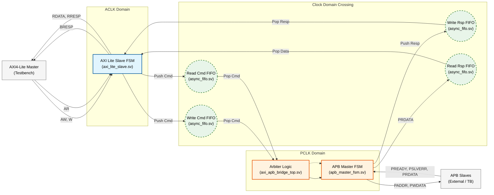

# AXI4-Lite-to-APB-Bridge-with-Asynchronous-CDC
Provide a small, easy-to-verify bridge that accepts AXI4-Lite transactions on the fast side and performs APB transfers to low-speed peripherals on the slow side. The bridge acts as an AXI4-Lite slave and as an APB master to selected peripherals, translating protocol and synchronizing clock domains. 

## Data & Control Flow


```mermaid
graph LR
    %% ==========================================
    %% Styles & Classes
    %% ==========================================
    classDef aclk fill:#e3f2fd,stroke:#1565c0,stroke-width:2px,color:black;
    classDef pclk fill:#fff3e0,stroke:#ef6c00,stroke-width:2px,color:black;
    classDef fifo fill:#e8f5e9,stroke:#2e7d32,stroke-width:2px,stroke-dasharray: 5 5,color:black;
    classDef ext  fill:#f5f5f5,stroke:#616161,stroke-width:1px,color:black;

    %% ==========================================
    %% Nodes
    %% ==========================================
    
    %% External
    Master["AXI4-Lite Master"]:::ext
    APB_Slave["APB Peripheral"]:::ext

    %% ACLK Domain - Added Quotes here
    subgraph ACLK_Domain ["ACLK Domain (Fast)"]
        AXI_FSM["AXI Slave FSM"]:::aclk
    end

    %% CDC (FIFOs)
    subgraph CDC ["Clock Domain Crossing"]
        Wr_Cmd_FIFO(("Write Cmd FIFO<br/>(Addr + Data)")):::fifo
        Wr_Rsp_FIFO(("Write Rsp FIFO<br/>(Status)")):::fifo
    end

    %% PCLK Domain - Added Quotes here
    subgraph PCLK_Domain ["PCLK Domain (Slow)"]
        Arbiter["Arbiter / Unpacker"]:::pclk
        APB_FSM["APB Master FSM"]:::pclk
    end

    %% ==========================================
    %% Write Data Path (Request)
    %% ==========================================
    Master -- "1. AWADDR, WDATA" --> AXI_FSM
    AXI_FSM -- "2. Push {Addr, Data}" --> Wr_Cmd_FIFO
    Wr_Cmd_FIFO -- "3. Pop {Addr, Data}" --> Arbiter
    Arbiter -- "4. Req (Addr, Data)" --> APB_FSM
    APB_FSM -- "5. PADDR, PWDATA<br/>(PSEL=1, PENABLE=1)" --> APB_Slave

    %% ==========================================
    %% Write Response Path (Ack)
    %% ==========================================
    APB_Slave -.-> |"6. PREADY, PSLVERR"| APB_FSM
    APB_FSM -- "7. Push Status (OK/ERR)" --> Wr_Rsp_FIFO
    Wr_Rsp_FIFO -- "8. Pop Status" --> AXI_FSM
    AXI_FSM -- "9. BRESP (BVALID)" --> Master

    %% ==========================================
    %% Link Styling
    %% ==========================================
    linkStyle 0,1,2,3,4 stroke:#1565c0,stroke-width:2px;  %% Data Path (Blue)
    linkStyle 5,6,7,8 stroke:#ef6c00,stroke-width:2px,stroke-dasharray: 5 5;  %% Response Path (Orange/Dashed)
```
