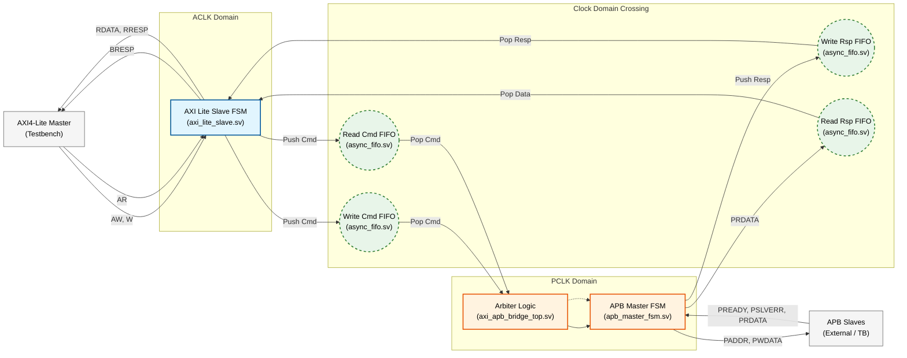
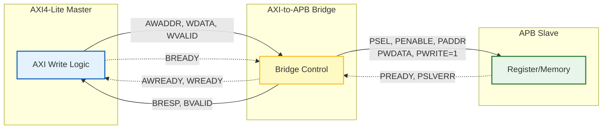
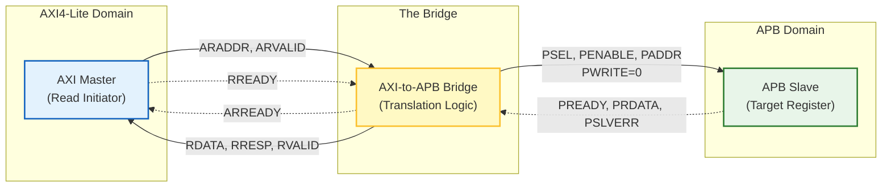

# AXI4-Lite to APB Bridge with Asynchronous CDC

This project implements a robust bridge between an **AXI4-Lite** master (fast clock domain) and an **APB** slave (slow clock domain). It features asynchronous FIFOs for safe Clock Domain Crossing (CDC) and a fully verifiable testbench.

## 1. System Data & Control Flow

This diagram illustrates how data flows from the AXI Master, through the CDC FIFOs, to the APB FSM, and back.


## End-to-End Transaction Logic

The diagrams below illustrate the complete data and control flow for both **Write** and **Read** transactions. They demonstrate how the Bridge translates protocols between the high-speed AXI4-Lite domain and the lower-speed APB domain.

### 1. Write Transaction Flow (Top Diagram)
This flow demonstrates a complete write operation:

- **Initiation:** The AXI4-Lite Master drives the write address (`AWADDR`) and write data (`WDATA`).
- **Translation:** The Bridge captures these signals and initiates an APB write cycle by asserting the select signal (`PSEL`), enable signal (`PENABLE`), and setting `PWRITE=1`.
- **Completion:** The APB Slave captures the data and asserts `PREADY`. The Bridge then completes the handshake by sending a write response (`BRESP`) back to the AXI Master.

### 2. Read Transaction Flow (Bottom Diagram)
This flow demonstrates a complete read operation:

- **Initiation:** The AXI4-Lite Master drives the read address (`ARADDR`).
- **Translation:** The Bridge initiates an APB read cycle by setting `PWRITE=0`. It waits for the peripheral to provide data.
- **Data Return:** The APB Slave places the requested data on `PRDATA` and asserts `PREADY`. The Bridge captures this data and drives it back to the AXI Master via the `RDATA` channel.



### 10. Asynchronous FIFO Design (CDC)

This diagram details the architecture of the **Asynchronous FIFO** used for safe Clock Domain Crossing. It ensures data integrity between the fast AXI domain and the slow APB domain using Gray-coded pointers.

* **Write Domain:** Manages the write pointer and checks for the `full` condition by comparing against the synchronized read pointer.
* **Read Domain:** Manages the read pointer and checks for the `empty` condition by comparing against the synchronized write pointer.
* **Synchronization:** Pointers are converted to Gray code this prevents multi-bit synchronization errors (metastability), and passed through 2-stage synchronizers (`sync_2ff`) to safely cross clock domains.
* **Comparator:** The Comparators are responsible for generating the status flags by comparing the local pointer against the synchronized pointer from the opposite domain.
      * Empty condition (Read Domain):

```mermaid
graph LR
    %% --- Subgraphs for Clock Domains ---
    subgraph Write_Domain [Write Clock Domain]
        direction TB
        WR_Logic["Write Ptr Logic<br/>(Counter)"]
        W_B2G["B2G Converter<br/>(Binary to Gray)"]
        W_Cmp{"Comparator<br/>(Check Full)"}
        RAM_WR["Dual-Port RAM<br/>(Write Port)"]
    end

    subgraph Read_Domain [Read Clock Domain]
        direction TB
        RD_Logic["Read Ptr Logic<br/>(Counter)"]
        R_B2G["B2G Converter<br/>(Binary to Gray)"]
        R_Cmp{"Comparator<br/>(Check Empty)"}
        RAM_RD["Dual-Port RAM<br/>(Read Port)"]
    end

    subgraph CDC_Sync [CDC Synchronization]
        direction TB
        Sync_W2R["2FF Synchronizer<br/>(W-Ptr to Read)"]
        Sync_R2W["2FF Synchronizer<br/>(R-Ptr to Write)"]
    end

    %% --- Styles ---
    classDef wr fill:#e1f5fe,stroke:#01579b,stroke-width:2px;
    classDef rd fill:#fff3e0,stroke:#e65100,stroke-width:2px;
    classDef sync fill:#e0e0e0,stroke:#616161,stroke-width:2px,stroke-dasharray: 5 5;
    classDef cmp fill:#fff9c4,stroke:#fbc02d,stroke-width:2px; 

    class WR_Logic,RAM_WR,W_B2G wr;
    class RD_Logic,RAM_RD,R_B2G rd;
    class Sync_W2R,Sync_R2W sync;
    class W_Cmp,R_Cmp cmp;

    %% --- Write Path Connections ---
    Input_WR("wr_en, wr_data") --> WR_Logic
    WR_Logic -- "wptr_bin (addr)" --> RAM_WR
    Input_WR --> RAM_WR
    
    %% B2G & Sync Flow
    WR_Logic -- "wptr_bin" --> W_B2G
    W_B2G -- "wptr_gray" --> Sync_W2R
    
    %% Full Flag Generation (Comparator)
    W_B2G -- "wptr_gray" --> W_Cmp
    Sync_R2W -- "rptr_gray_sync" --> W_Cmp
    W_Cmp -- "Match = Full" --> Output_Full("Output: full")

    %% --- Read Path Connections ---
    Input_RD("rd_en") --> RD_Logic
    RD_Logic -- "rptr_bin (addr)" --> RAM_RD
    RAM_RD -- "rd_data" --> Output_Data("Output: rd_data")
    
    %% B2G & Sync Flow
    RD_Logic -- "rptr_bin" --> R_B2G
    R_B2G -- "rptr_gray" --> Sync_R2W

    %% Empty Flag Generation (Comparator)
    R_B2G -- "rptr_gray" --> R_Cmp
    Sync_W2R -- "wptr_gray_sync" --> R_Cmp
    R_Cmp -- "Match = Empty" --> Output_Empty("Output: empty")

    %% --- CDC Crossings (2FF) ---
    Sync_W2R -.-> R_Cmp
    Sync_R2W -.-> W_Cmp
