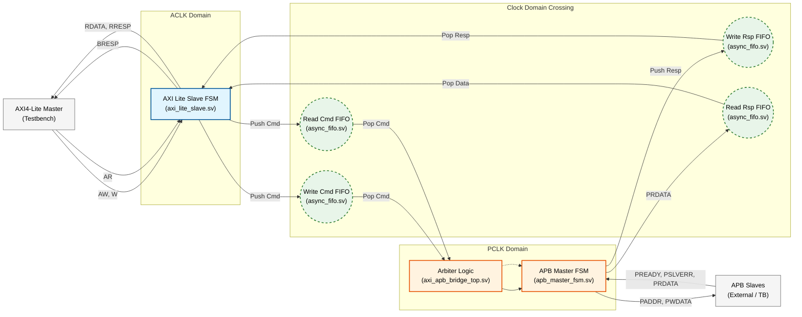
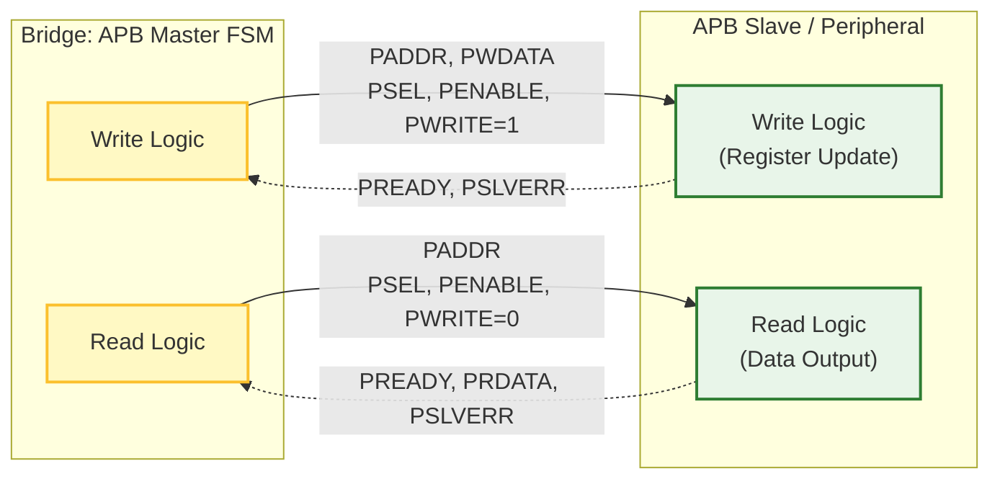
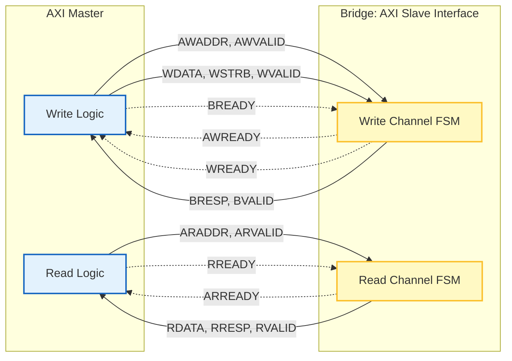
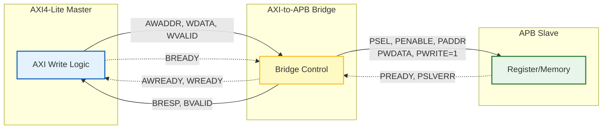

# AXI4-Lite to APB Bridge with Asynchronous CDC

This project implements a robust bridge between an **AXI4-Lite** master (fast clock domain) and an **APB** slave (slow clock domain). It features asynchronous FIFOs for safe Clock Domain Crossing (CDC) and a fully verifiable testbench.

## 1. System Data & Control Flow

This diagram illustrates how data flows from the AXI Master, through the CDC FIFOs, to the APB FSM, and back.



## 2. AXI4-Lite Handshake Diagram (Slave Side)

The bridge acts as an **AXI Slave**. It accepts address and data from the master and provides responses.



## 3. APB Handshake Diagram (Master Side)

The bridge acts as an **APB Master**. It drives controls to the peripheral and waits for `PREADY`.


## 3. write

The bridge acts as an **APB Master**. It drives controls to the peripheral and waits for `PREADY`.


## 3. read

The bridge acts as an **APB Master**. It drives controls to the peripheral and waits for `PREADY`.

```mermaid
graph LR
    %% Definitions
    subgraph AXI_Side [AXI4-Lite Domain]
        direction TB
        AXI_M["AXI Master<br/>(Read Initiator)"]
    end
    
    subgraph Bridge_Scope [The Bridge]
        direction TB
        DUT["AXI-to-APB Bridge<br/>(Translation Logic)"]
    end

    subgraph APB_Side [APB Domain]
        direction TB
        APB_S["APB Slave<br/>(Target Register)"]
    end

    %% Styles
    classDef master fill:#e3f2fd,stroke:#1565c0,stroke-width:2px;
    classDef bridge fill:#fff9c4,stroke:#fbc02d,stroke-width:2px;
    classDef slave fill:#e8f5e9,stroke:#2e7d32,stroke-width:2px;
    
    class AXI_M master;
    class DUT bridge;
    class APB_S slave;

    %% --- PHASE 1: AXI Read Request ---
    %% Master sends Address
    AXI_M -- "ARADDR, ARVALID" --> DUT
    %% Bridge accepts
    DUT -. "ARREADY" .-> AXI_M

    %% --- PHASE 2: APB Read Transaction ---
    %% Bridge drives APB Read (PWRITE=0)
    DUT -- "PSEL, PENABLE, PADDR<br/>PWRITE=0" --> APB_S
    %% Slave returns Data and Status
    APB_S -. "PREADY, PRDATA, PSLVERR" .-> DUT

    %% --- PHASE 3: AXI Read Response ---
    %% Bridge sends Data back
    DUT -- "RDATA, RRESP, RVALID" --> AXI_M
    %% Master accepts response
    AXI_M -. "RREADY" .-> DUT
