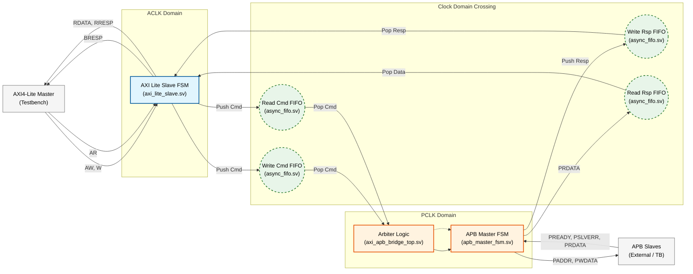
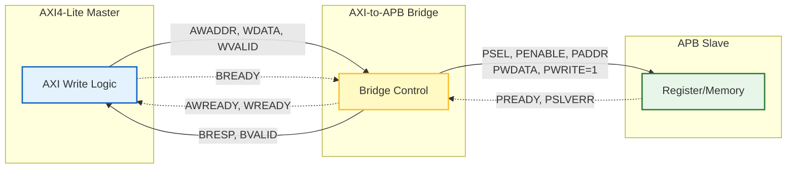
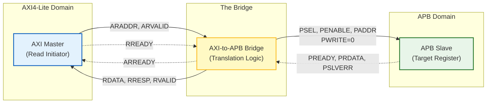
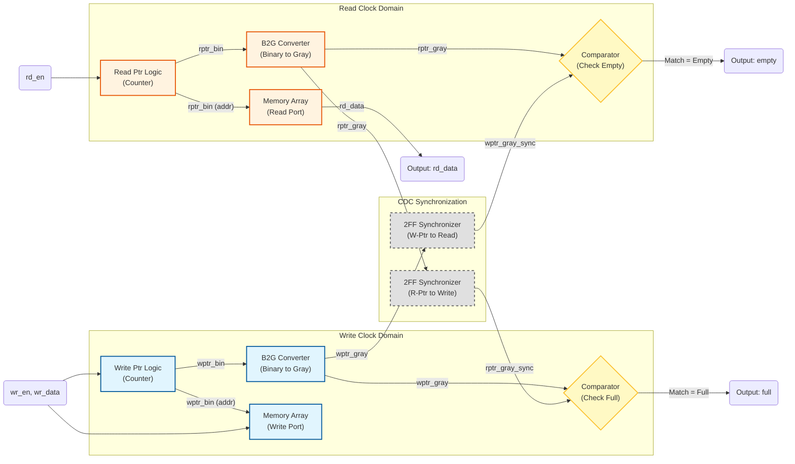

# AXI4-Lite to APB Bridge with Asynchronous CDC

**Author:** Noam Malca  
**Institution:** Bar-Ilan University  
**Focus:** Digital Design - Bus Protocols (AXI/APB), CDC, & Verification

This project implements a robust bridge between a high-speed **AXI4-Lite** master (fast clock domain) and an **APB** slave (slow clock domain) in Verilog HDL. 
It is designed to handle cross-domain data integrity using **Asynchronous FIFOs** for command and response paths, ensuring safe operation without metastability.

The design includes a dedicated AXI Slave FSM, an APB Master FSM, and a custom **Clock Domain Crossing (CDC)** logic block utilizing Gray-coded pointers and 2-stage synchronizers (2FF). It is accompanied by a self-checking testbench.

---

## Key Features
* **Protocol Translation:** Converts AXI4-Lite transactions to APB transfers.
* **Robust CDC:** Uses dual-clock asynchronous FIFOs with Gray-code pointer exchange.
* **Metastability Protection:** Implements 2FF synchronizers on all cross-domain control signals.
* **Data Integrity:** Guarantees data consistency between fast (AXI) and slow (APB) clock domains.
* **Full Verification:** Includes a behavioral APB slave model and automated transaction checkers.

---

## 1. System Data & Control Flow

This diagram illustrates how data flows from the AXI Master, through the CDC FIFOs, to the APB FSM, and back.

---
## End-to-End Transaction Logic

The diagrams below illustrate the complete data and control flow for both **Write** and **Read** transactions. They demonstrate how the Bridge translates protocols between the high-speed AXI4-Lite domain and the lower-speed APB domain.

### 1. Write Transaction Flow (Top Diagram)
This flow demonstrates a complete write operation:

- **Initiation:** The AXI4-Lite Master drives the write address (`AWADDR`) and write data (`WDATA`).
- **Translation:** The Bridge captures these signals and initiates an APB write cycle by asserting the select signal (`PSEL`), enable signal (`PENABLE`), and setting `PWRITE=1`.
- **Completion:** The APB Slave captures the data and asserts `PREADY`. The Bridge then completes the handshake by sending a write response (`BRESP`) back to the AXI Master.

### 2. Read Transaction Flow (Bottom Diagram)
This flow demonstrates a complete read operation:

- **Initiation:** The AXI4-Lite Master drives the read address (`ARADDR`).
- **Translation:** The Bridge initiates an APB read cycle by setting `PWRITE=0`. It waits for the peripheral to provide data.
- **Data Return:** The APB Slave places the requested data on `PRDATA` and asserts `PREADY`. The Bridge captures this data and drives it back to the AXI Master via the `RDATA` channel.

---
### 3. Asynchronous FIFO Design (CDC)

This diagram details the architecture of the **Asynchronous FIFO** used for safe Clock Domain Crossing. It ensures data integrity between the fast AXI domain and the slow APB domain using Gray-coded pointers.

* **Write Domain:** Manages the write pointer and checks for the `full` condition by comparing against the synchronized read pointer.
* **Read Domain:** Manages the read pointer and checks for the `empty` condition by comparing against the synchronized write pointer.
* **Synchronization:** Pointers are converted to Gray Code to prevent multi-bit synchronization errors (metastability) and passed through 2-stage synchronizers (`sync_2ff`) to safely cross clock domains.
* **Comparator Logic:** The Comparators generate the status flags by comparing the local pointer against the synchronized pointer from the opposite domain.
    * **Empty Detection Logic (Read Domain):**
        * **Condition:** Occurs when the synchronized write pointer exactly matches the read pointer (`rgray_next == wptr_gray_sync`).
        * **Meaning:** The pointers are identical, meaning the buffer is empty and reading must be disabled.
    * **Full Detection Logic (Write Domain):**
        * **Condition:** Occurs when the write pointer "wraps around" and catches the read pointer. In Gray Code, this is detected when the **two MSBs are different (inverted)** and all remaining LSBs match.
        * **Meaning:** The buffer is full and writing must be disabled to prevent data overwrite

---
### Test 0: Read Request with APB Stall & Recovery

This test verifies the system's robustness when the **AXI Master initiates a read transaction** (`ARADDR`) while the **APB Slave is not ready** (`PREADY=0`), and validates the correct completion once the Slave becomes ready.

**Objective:**
To ensure that the bridge **does not output invalid ("garbage") data** while waiting, and correctly completes the handshake **only after** valid data is available.

**Waveform Analysis:**

1.  **Phase 1: The Stall (PREADY = 0)**
    * **Address Capture:** The AXI Master drives the address, and the bridge captures it (`araddr_reg` updates).
    * **System Freeze:** Since `PREADY` is Low, the `rd_rsp_fifo_empty` signal remains **High**.
    * **Clean Wait:** Even though the Master is ready to receive data (`RREADY=1`), the bridge keeps `RVALID` at **0**. This emphasizes that **absolutely no transaction occurs** until the APB side is ready.

2.  **Phase 2: The Release (PREADY = 1)**
    * **Data Availability:** As soon as `PREADY` goes High, the data is pushed into the FIFO, causing `rd_rsp_fifo_empty` to drop to **Low**.
    * **Transaction Completion:** Immediately after the FIFO becomes non-empty, the bridge asserts `RVALID`. Since `RREADY` is already High, a valid handshake occurs, and the read transaction is successfully closed.
---

### Test 1: Write Burst with Backpressure (APB Stall)

This test evaluates the bridge's flow control mechanisms by flooding the system with **6 consecutive write commands** while the APB Slave is stalled (`PREADY=0`).

**Objective:**
To verify that the system correctly buffers data up to its maximum capacity (FIFO + Output Stage) and exerts backpressure on the AXI Master when full, preventing data loss.

**Waveform Analysis:**

*(Note: Update the link to your actual image file)*

1.  **Capacity Analysis (FIFO + 1):**
    * The system utilizes a **Depth-4 FIFO**, yet it successfully accepts **5 Write Commands** before blocking.
    * **Reasoning:** Command #1 immediately propagates to the APB Driver (the "Holding Stage"), freeing up a slot in the FIFO. Consequently, the FIFO buffers Commands #2, #3, #4, and #5.
    * **Backpressure:** When Command #6 attempts to enter, the system is fully saturated. The bridge correctly de-asserts `AWREADY`/`WREADY`, blocking the 6th command until space becomes available.

2.  **FSM & Signal Behavior:**
    * **State Transition:** Following the handshake (`req_valid` & `req_ready`), the APB FSM transitions from **IDLE** to **SETUP**, capturing the address and data of Command #1.
    * **Stall in ACCESS Phase:** In the next cycle, the FSM moves to **ACCESS** and asserts `PENABLE`. However, since `PREADY` is Low, the FSM holds this state, keeping Command #1 valid on the bus.
    * **Data Integrity:** The waveform shows that Command #5's data is safely stored in the FIFO but is **not written to the Slave memory** (`mem`) until Command #1 completes and clears the pipeline.

3.  **Stall Release:**
    * After 20 cycles, `PREADY` is driven High.
    * The bridge completes the pending transaction (Command #1), moves to the next command in the FIFO, and the remaining data flows sequentially to update the Slave memory.

