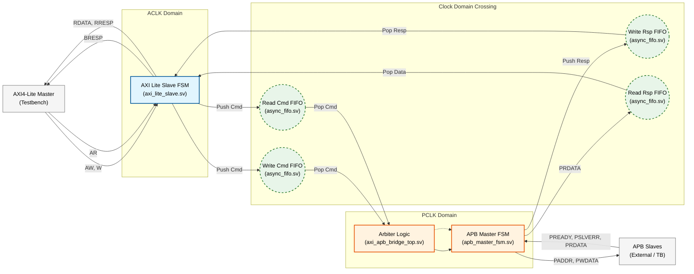
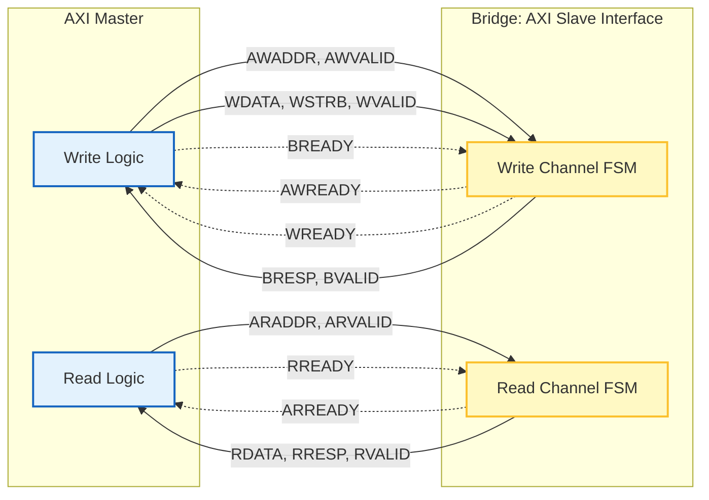

# AXI4-Lite to APB Bridge with Asynchronous CDC

This project implements a robust bridge between an **AXI4-Lite** master (fast clock domain) and an **APB** slave (slow clock domain). It features asynchronous FIFOs for safe Clock Domain Crossing (CDC) and a fully verifiable testbench.

## 1. System Data & Control Flow

This diagram illustrates how data flows from the AXI Master, through the CDC FIFOs, to the APB FSM, and back.



## 2. AXI4-Lite Handshake Diagram (Slave Side)

The bridge acts as an **AXI Slave**. It accepts address and data from the master and provides responses.

```mermaid


```

## 3. APB Handshake Diagram (Master Side)

The bridge acts as an **APB Master**. It drives controls to the peripheral and waits for `PREADY`.


