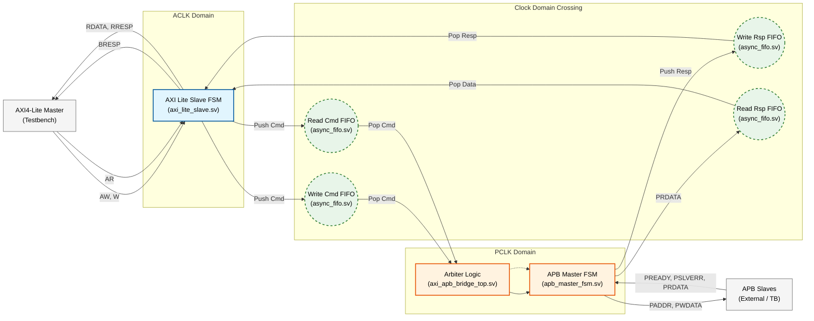
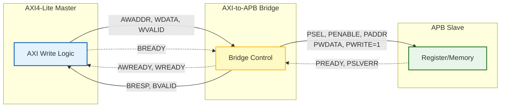
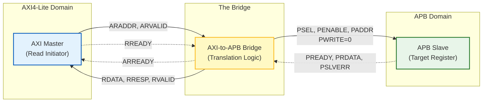

# AXI4-Lite to APB Bridge with Asynchronous CDC

This project implements a robust bridge between an **AXI4-Lite** master (fast clock domain) and an **APB** slave (slow clock domain). It features asynchronous FIFOs for safe Clock Domain Crossing (CDC) and a fully verifiable testbench.

## 1. System Data & Control Flow

This diagram illustrates how data flows from the AXI Master, through the CDC FIFOs, to the APB FSM, and back.


## End-to-End Transaction Logic

The diagrams below illustrate the complete data and control flow for both **Write** and **Read** transactions. They demonstrate how the Bridge translates protocols between the high-speed AXI4-Lite domain and the lower-speed APB domain.

### 1. Write Transaction Flow (Top Diagram)
This flow demonstrates a complete write operation:

- **Initiation:** The AXI4-Lite Master drives the write address (`AWADDR`) and write data (`WDATA`).
- **Translation:** The Bridge captures these signals and initiates an APB write cycle by asserting the select signal (`PSEL`), enable signal (`PENABLE`), and setting `PWRITE=1`.
- **Completion:** The APB Slave captures the data and asserts `PREADY`. The Bridge then completes the handshake by sending a write response (`BRESP`) back to the AXI Master.

### 2. Read Transaction Flow (Bottom Diagram)
This flow demonstrates a complete read operation:

- **Initiation:** The AXI4-Lite Master drives the read address (`ARADDR`).
- **Translation:** The Bridge initiates an APB read cycle by setting `PWRITE=0`. It waits for the peripheral to provide data.
- **Data Return:** The APB Slave places the requested data on `PRDATA` and asserts `PREADY`. The Bridge captures this data and drives it back to the AXI Master via the `RDATA` channel.



### 10. Asynchronous FIFO Design (CDC)

This diagram details the architecture of the **Asynchronous FIFO** used for safe Clock Domain Crossing. It ensures data integrity between the fast AXI domain and the slow APB domain using Gray-coded pointers.

* **Write Domain:** Manages the write pointer and checks for the `full` condition by comparing against the synchronized read pointer.
* **Read Domain:** Manages the read pointer and checks for the `empty` condition by comparing against the synchronized write pointer.
* **Synchronization:** Pointers are converted to Gray code and passed through 2-stage synchronizers (`sync_2ff`) to safely cross clock domains.

```mermaid
graph LR
    %% --- Define Styles ---
    classDef tb_infra fill:#f5f5f5,stroke:#616161,stroke-width:1px,stroke-dasharray: 5 5;
    classDef driver fill:#e3f2fd,stroke:#1565c0,stroke-width:2px;
    classDef dut fill:#fff9c4,stroke:#fbc02d,stroke-width:2px;
    classDef slave_model fill:#e8f5e9,stroke:#2e7d32,stroke-width:2px;

    %% --- Main Container ---
    subgraph TB_Top [tb_axi_apb_bridge_top]
        direction LR
        
        %% Infrastructure
        CLK_RST["Clock & Reset Gen<br/>(ACLK, PCLK, Resets)"]:::tb_infra

        %% Driver Side
        subgraph AXI_Stimulus [AXI Master Driver & Monitor]
            direction TB
            Tasks["AXI Tasks<br/>(issue_write/read)"]:::driver
            MainTest["Main Test Sequence<br/>(initial begin...)"]:::driver
            Checkers["Handshake Counters<br/>& Data Checkers"]:::driver
        end

        %% The Design Under Test
        DUT["DUT:<br/>axi_apb_bridge_top"]:::dut

        %% Slave Side
        subgraph Slave_Model [APB Slave Behavioral Model]
            direction TB
            MemArray["Memory Array<br/>mem[0:15]"]:::slave_model
            SlaveLogic["PREADY & PRDATA Logic<br/>(always_comb/ff)"]:::slave_model
        end

        %% --- Connections ---
        %% Clocks feeding everything
        CLK_RST ==> AXI_Stimulus
        CLK_RST ==> DUT
        CLK_RST ==> Slave_Model

        %% AXI Interface flow
        Tasks -- "AXI Stimulus<br/>(AW, W, AR Channels)" --> DUT
        DUT -- "AXI Responses<br/>(B, R Channels)" --> Tasks
        DUT -.- Checkers

        %% APB Interface flow
        DUT -- "APB Commands<br/>(PSEL, PENABLE, PWRITE, PWDATA)" --> SlaveLogic
        SlaveLogic -- "APB Responses<br/>(PREADY, PRDATA)" --> DUT
        
        %% Internal Slave Model connection
        SlaveLogic <--> MemArray
    end
